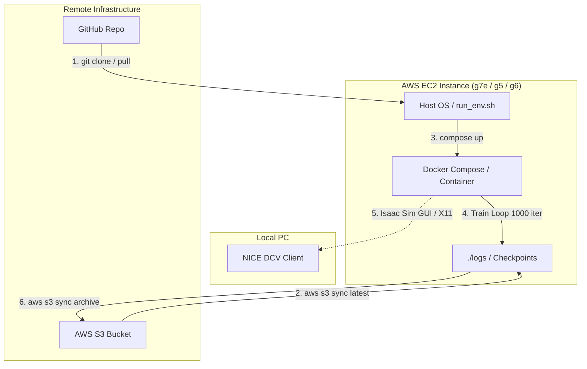

# g1-handover-project

Unitree G1 ヒューマノイドロボットを用いた、ノベルティハンドオーバー（手渡し）タスクの強化学習プロジェクト。AWSマルチインスタンス環境において、完全にポータブルかつ一発で再現可能なシミュレーション環境を提供します。

## 🛠️ 技術スタック


---

## 📊 システムアーキテクチャ (Mermaid)

AWSのキャパシティ不足を回避するため、コードと学習成果物、シミュレーション映像の経路を完全に分離・ポータブル化しています。



## 🚀 Quick Start

どのAWS GPUインスタンス（Ubuntu 22.04 LTS, NVIDIA Driver/Dockerインストール済み）からでも、以下のステップのみで環境構築と学習が自動実行されます。

### 1. 前提条件の確認 (AWS セキュリティグループ)

接続元のローカルPC（マイIP）に対し、以下のインバウンドルールが開放されていることを確認してください。

* **TCP:** `49100` (シグナリング用固定ポート)
* **UDP:** `47998` (映像ストリーム用固定ポート)

### 2. クローンと実行

```bash
# 1. リポジトリの取得
git clone [https://github.com/](https://github.com/)<your-username>/g1-handover-project.git
cd g1-handover-project

# 2. S3バケット名の環境変数を設定 (または run_env.sh 内で固定)
# export S3_BUCKET="your-isaac-sim-s3-bucket-name"

# 3. 起動スクリプトを実行 (環境構築・S3同期・学習キックまで自動)
chmod +x run_env.sh
./run_env.sh

```

### 3. DCVからの接続

1. SSHトンネルを作成: `ssh -L 8443:localhost:8443 avita-g5.24`
2. DCV Clientで `localhost:8443` に接続。
3. DCV上のターミナルで `./scripts/check_dcv_environment.sh` を実行。


WebRTC Client で固着する場合は、DCVデスクトップへ接続し、DCV内のターミナルからIsaac Simを起動してください。Isaac SimのウィンドウはDCVのX11画面へ直接表示されます。

```bash
echo "$DISPLAY"                         # 例: :1 または :2
export XAUTHORITY="${XAUTHORITY:-/run/user/$(id -u)/dcv/gui.xauth}"
echo "$XAUTHORITY"
xdpyinfo -display "$DISPLAY" >/dev/null && echo "X display OK"
chmod +x scripts/run_playback_dcv.sh
./scripts/run_playback_dcv.sh g1_handover_teacher policy
```

`DISPLAY` が空、または `xdpyinfo` が失敗する場合は、DCVセッション内のターミナルではありません。DCVのデスクトップからターミナルを起動して再実行してください。DCVでは通常 `/run/user/<uid>/dcv/gui.xauth` が認証ファイルです。`XAUTHORITY` が未設定でも、スクリプトがこのファイルを優先して自動検出します。

`X display OK` の後に `X Error ... GLXBadFBConfig` が出てIsaac Simが終了する場合は、DCVのX11認証ではなく、DCVサーバー側のGPU/OpenGLアクセラレーションが未設定です。DCV管理者側でGPU対応GLX（DCV GL）が有効であることを確認してから再実行してください。`OmniHub`、`isaaclab_visualizers`、`failed to open the default display` はこのエラーの直接原因ではありません。

この経路では `--livestream`、WebRTCポート、public IP を使用しません。WebRTCを完全に経由しないため、DCV上でカメラ操作とG1の動作確認を行えます。

DCVサーバーの確認:

```bash
nvidia-smi
echo "$DISPLAY"
export XAUTHORITY="${XAUTHORITY:-/run/user/$(id -u)/dcv/gui.xauth}"
xdpyinfo -display "$DISPLAY" >/dev/null && echo "X display OK"
```

`X display OK` でも `GLXBadFBConfig` が出る場合は、DCVサーバー設定でGPUアクセラレーション/OpenGL（LinuxではDCV GL、必要に応じて `enable-gl-in-headless-mode`）を有効化する必要があります。これはリポジトリ内のDocker設定だけでは変更できません。

期待結果:

1. DCV画面上で Isaac Sim のウィンドウが開く。
2. マウスで視点移動ができる。
3. ログに `playback step` が出続ける間、ロボット挙動を直接目視できる。

停止:

```bash
docker rm -f isaac-sim-groot
```

従来のX11デスクトップ経路を使う場合は `scripts/run_playback_desktop.sh` と `playback-desktop` プロファイルを使用できます。DCV環境では `run_playback_dcv.sh` を優先してください。

### 7. NICE DCV + NVIDIA GPU policy再生

SSHトンネル経由でDCV Clientへ接続する場合:

```bash
ssh -L 8443:localhost:8443 avita-g5.24
```

DCV Clientは `localhost:8443` に接続し、ユーザー `ubuntu` でログインします。DCV接続後、SSHターミナル上でGDMのXauthorityを利用してGPU描画を有効化します。

```bash
sudo XAUTHORITY=/run/user/127/gdm/Xauthority DISPLAY=:0 xhost +
sudo cp /run/user/127/gdm/Xauthority "$HOME/.Xauthority"
sudo chown "$(id -u):$(id -g)" "$HOME/.Xauthority"

export XAUTHORITY="$HOME/.Xauthority"
export DISPLAY=:0

glxinfo | grep -E "OpenGL vendor|OpenGL renderer"
```

`OpenGL renderer string: NVIDIA A10G/PCIe/SSE2` が確認できたら、G1の学習済みpolicyをDCV画面へ直接再生します。

```bash
cd ~/Workspace/g1-handover-project
chmod +x scripts/check_dcv_environment.sh scripts/run_playback_dcv.sh
./scripts/check_dcv_environment.sh

chmod +x scripts/run_playback_dcv.sh
./scripts/run_playback_dcv.sh g1_handover_teacher policy
```

`check_dcv_environment.sh` が `Host X11: OK`、`Host NVIDIA OpenGL: OK`、`Container GPU/X11 mounts: OK` まで出てから再生へ進みます。`DISPLAY` が未設定の場合、この診断スクリプトはDCVの標準値として `:0` を使用します。

このコマンドはWebRTC Clientを使用せず、最新のローカルcheckpoint（なければS3から同期）を選択してDCVのIsaac Sim GUIへ表示します。停止は `Ctrl+C`、または別ターミナルから次を実行します。

```bash
docker rm -f isaac-sim-groot
```


## 🛠 開発ルール (Docs as Code)

プロジェクトの再現性を維持するため、以下のルールを厳守してください。

1. **GitHubとS3の役割分担 (必須)**
* **GitHub:** ソースコードのみを管理。`logs/` ディレクトリは大容量の `.pt` ファイルを含むため、`.gitignore` で完全除外されています。
* **S3:** 学習成果物（チェックポイント、TensorBoardログ）を管理。`run_env.sh` が起動時と終了時に自動で双方向同期します。


2. **依存関係の追加ルール**
* Isaac Lab の `extras`（`mimic`, `visualizers`, `teleop`）は `psutil` や `websockets` の致命的なバージョン衝突を引き起こすため、**インストール禁止**とします。
* 必要なモジュールは `scripts/container_entrypoint.sh` に `omni.isaac.lab` コア系のみを明示して最小インストールしてください。


3. **Isaac Lab 6.x API 準拠**
* 旧引数（`--headless` など）は非推奨です。
* タスククラス（`g1_handover_env.py`）の実装時は、最新の `ManagerBasedRLEnvCfg` に従い、`ObservationManagerCfg`, `ActionTermCfg`, `TerminationTermCfg` を用いてマネージャー駆動で記述してください。

### ブランチ命名規則

| Prefix | 用途 | SemVer影響 | 例 |
| :--- | :--- | :--- | :--- |
| `main` | メインブランチ | なし | `main` |
| `develop` | ステージングブランチ | なし | `develop` |
| `feature/` | 新機能追加 | Minor | `feature/add-login-function` |
| `bugfix/` | バグ修正 | Patch | `bugfix/fix-crash-on-startup` |
| `hotfix/` | 緊急修正 | Patch | `hotfix/fix-security-vulnerability` |
| `release/` | リリース準備 | Patch/Minor | `release/v1.2.0-prep` |
| `docs/` | ドキュメント更新のみ | Patch | `docs/update-api-docs` |
| `chore/` | その他メンテナンス | Patch | `chore/update-dependencies` |

### コミットメッセージ規約

- `type(scope): subject` 例: `feat(api): add login`
- type例: feat, fix, docs, chore, refactor, test, ci
- scopeは任意、subjectは簡潔に

### 運用のポイント

- **Docs as Code**: コード修正時はdocs/も必ず更新
- **main直Push禁止**: PR経由でマージ
- **CI/CD必須**: GitHub Actions等で自動テスト・デプロイ
- **README.md整備**: QuickStart・開発手順・依存関係を明記
- **テンプレート活用**: PRテンプレート・Issueテンプレートを用意
