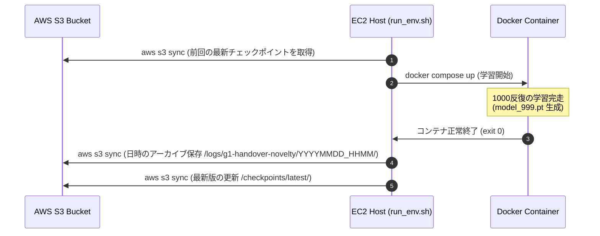

# NICE DCV 接続 & S3同期ライフサイクル

## 🖥️ DCV接続

映像確認とカメラ操作はNICE DCV上で行います。Isaac Sim用のストリーミングクライアントや専用ストリーミングポートは使用しません。

```bash
ssh -L 8443:localhost:8443 avita-g5.24
```

DCV Clientは `localhost:8443` に接続します。DCV接続後、DCVデスクトップ内のTerminalでGPU描画を確認します。`DISPLAY` と `XAUTHORITY` は現在のセッション値を使用します。

```bash
echo "DISPLAY=$DISPLAY"
echo "XAUTHORITY=$XAUTHORITY"
xdpyinfo -display "$DISPLAY" >/dev/null
glxinfo | grep -E "OpenGL vendor|OpenGL renderer"
```

`NVIDIA A10G` が表示されることを確認してから、`scripts/check_dcv_environment.sh` を実行します。

## ☁️ S3データライフサイクル

大容量の学習成果物（`.pt` ファイルや TensorBoard ログ）は GitHub の管理から完全に除外（`.gitignore`）し、AWS S3 バケット `s3://g1-gr00t-models-380421147972-us-east-1-an/` で一元管理します。

