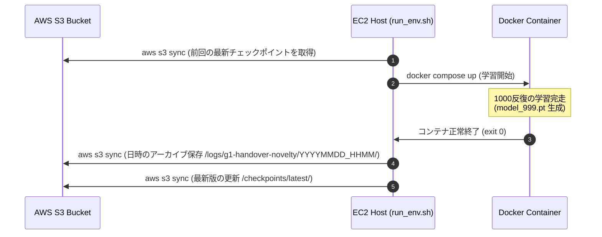

# AWSポート設定 & S3同期ライフサイクル

## 🔌 ポートマッピングの固定理由

最新の Isaac Sim WebRTC ストリーミングでは、インフラの暗号化バグやNAT越えの失敗を防止するため、公式ドキュメントに準拠した以下の **2つのポートのみをピンポイントで開放** します。

*   **TCP: 49100** (シグナリング通信用)
*   **UDP: 47998** (映像・操作ストリーム用)

!!! warning "ローカルアプリ接続時の注意点"
    ローカルPCの **Isaac Sim WebRTC Streaming Client 2.0.0** から接続する際、Server欄には `54.175.219.198` のように**パブリックIPアドレスのみ**を入力してください。`:49100` などのポート番号を末尾に付与すると、アプリ内部のエラーにより画面が真っ黒のまま即時切断（`NVST_CCE_DISCONNECTED`）されます。

## ☁️ S3データライフサイクル

大容量の学習成果物（`.pt` ファイルや TensorBoard ログ）は GitHub の管理から完全に除外（`.gitignore`）し、AWS S3 バケット `s3://g1-gr00t-models-380421147972-us-east-1-an/` で一元管理します。

